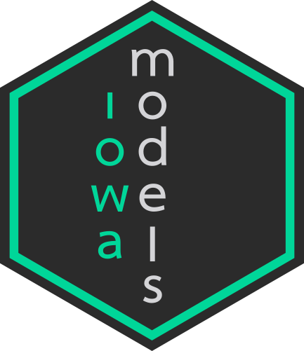

# iowamodels 

The **iowamodels** package is a backend to the **iowa** package, and implements modular
reinforcement learning models of the Iowa gambling task. Model components are
implemented in Stan, and are compiled into cmdstan models which are then made
available internally to other packages.

The package implements the simulation and fitting of models constructed by
mixing and matching various utility, updating, and temperature functions; and is
designed to be relatively extensible by allowing users to implement custom
model components.

In addition to simulating the performance of custom models, **iowamodels** also allows
model fitting either by maximum likelihood / maximum a posteriori estimation,
or by full posterior sampling. Currently, only single subject fitting is supported, 
but support for full hierarchical Bayesian fitting is a strong priority.
