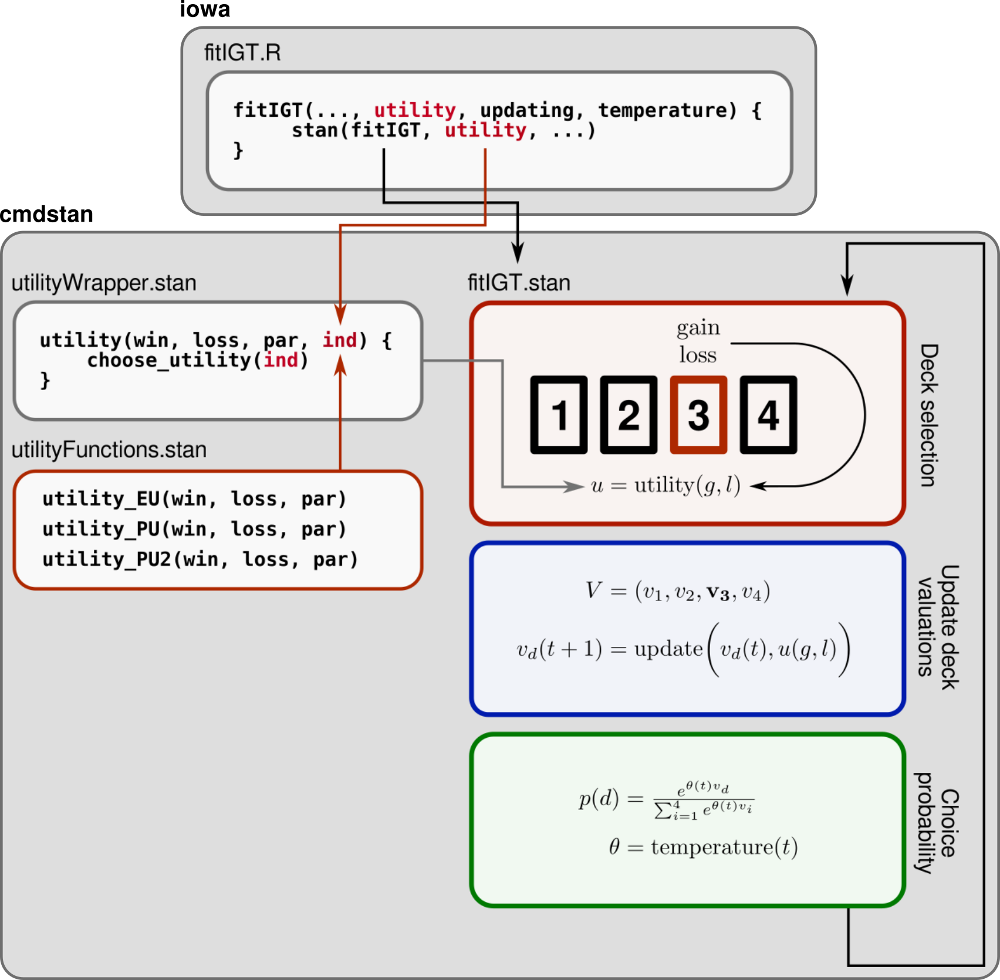

```{r setup, include = FALSE}
knitr::opts_chunk$set(
  collapse = TRUE,
  comment = "#>"
)
```

Adding new model components (e.g. new utility functions) involves two broad steps:

- Making the component available to stan, which is responsible for all model
simulation and fitting.
- Updating **iowamodels**'s internal information about the model component, including
parameter names, bounds, etc.

Although the actual process of adding a new component is slightly tedious, the
ultimate goal is that, once added, the new component can be used with all package
functions (and combined with all other components) with a minimum of thought or fuss.

### Internal package structure

The general structure of the package is as follows:

- External packages (such as **iowa**) interface with **iowamodels** through 
wrapper functions such as `simulateIGT()` and `fitIGT()`, which provide a high-level
interface to the cmdstan models implemented in **iowamodels**.
- Models are implemented in `src/stan/<modelfile>>.stan`.
- The actual component functions (e.g. the specific utility function) are passed
internally as data to the stan model, which are then imported from a separate `.stan`
file. These separate files are stored in `src/stan/include`, with the names e.g.
`utilityFunctions.stanfunctions`. 

For example, `src/stan/fitIGT.stan` -- which is responsible for model fitting --
specifies a general model as follows:

```
// Likelihood
for (t in 1:NUM_TRIALS){

    // Compute temperature
    theta = temperature(t, temperature_params, TEMPERATURE_FUNCTION);

    // Draw card
    choice[t] ~ categorical_logit(theta * V);

    // Compute utility
    U = utility(win[t], loss[t], utility_params, UTILITY_FUNCTION);

    // Update deck values
    V = updating(V, U, choice[t], updating_params, UPDATING_FUNCTION);
}
```

On trial `t`, the utility of the outcome is evaluated through the function

```
utility(win[t], loss[t], utility_params, UTILITY_FUNCTION);
```

where `utility` is imported from `src/stan/include/utilityWrapper.stanfunctions`, and
is defined by

```
real utility(real win, real loss, array[] real par, int ind){

    if (ind == 1){
        return utility_EU(win, loss, par);
    } else if (ind == 2){
        return utility_PU(win, loss, par);
    } else if (ind == 3){
        return utility_PU2(win, loss, par);
    } else {
        return 0;
    }
}
```

Note that this function is just a general wrapper that calls one of several
utility functions depending on the integer argument `ind`. In turn, all utility
functions are defined in `inst/stan/include/utilityFunctions.stan`. 

As an example, the EU and PU utility are defined by:

```
// EU utility function (used in EV model)
real utility_EU(real win, real loss, array[] real par) {
    return (1-par[1]) * win - par[1] * loss;
}

// Prospect utility function
real utility_PU(real win, real loss, array[] real par) {
    real net = win - loss;
    if (net >= 0){
        return pow(net, par[1]);
    } else {
        return -par[2] * pow(abs(net), par[1]);
    }
}
```

Note an important point: **All utility functions have exactly the same signature**;
that is `real win, real loss, array[] real par`. 

The package in turn contains a `modelDetails` object contained in `R/sysdata.rda`. This
structure is a nested list containing information about each model component; such
as its required parameters, and any necessary (or default) bounds.

The structure of this list is as follows:

```
modelDetails
.  utility
. .  EU
. . .  index = 1
. . .  pars
. . . .  w
. . . . .  bounds = c(0,1)
. . . . .  default_bounds = c(0, 1)
. . . . .  description = "Win/loss weighting"
. . . . .  index = 1
. .  PU
. . .  index = 2
. . .  pars
. . . .  A
. . . . .  bounds = c(0, Inf)
. . . . .  default_bounds = c(0, 1)
. . . . .  description = "Concavity of utility function"
. . . . .  index = 1
. . . .  L
. . . . .  bounds = c(0, Inf)
. . . . .  default_bounds = c(0, 5)
. . . . .  description = "Loss aversion"
. . . . .  index = 2
```

That is, it has fields `utility`, `updating`, and `temperature`; each of which is 
a named list with fields corresponding to each included function. The field `index`
indicates the corresponding value of `ind` in the stan wrapper function (e.g.
`utility(..., ind = 1)` chooses the EV utility), while the index within each 
parameter field specifies the position of each parameter in the `par` argument.
The parameter fields also contain entries giving parameter bounds (outside of 
which the package will throw an error), as well as default bounds used for model 
fitting if the user does not specify their own.

The general structure of the package program is illustrated below, using the
utility function as an example:

```{r, echo=FALSE, fig.align = 'center'}
# All defaults

```

### Implementing a new model component

Adding a new utility function to **iowamodels** now involves the following steps:

1. Add the function to `src/stan/include/utilityFunctions.stanfunctions`, making sure
that it matches the required signature.
2. Add a new `if` statement to `src/stan/include/utilityWrapper.stanfunctions`, corresponding
to the next highest value of `ind`.
3. Add a new field to `modelDetails` in the `utility` field -- named with the unique
keyword of the new utility function -- and populate it with the necessary fields
(i.e. one subfield for each parameter, each with the required fields `bounds` and
`default_bounds`). The index field must correspond to the value of `ind` which 
calls the new utility function in step (2). 
4. Resave `modelDetails` to `R/sysdata.rda` using `save(modelDetails, file = 'R/sysdata.rda')`.

After the package is recompiled, the new utility function should be ready for use.

The steps for adding new updating or temperature functions are essentially identical,
*mutatis mutandis*.
